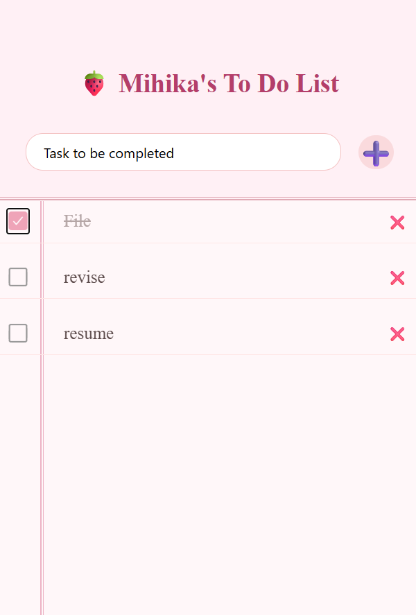
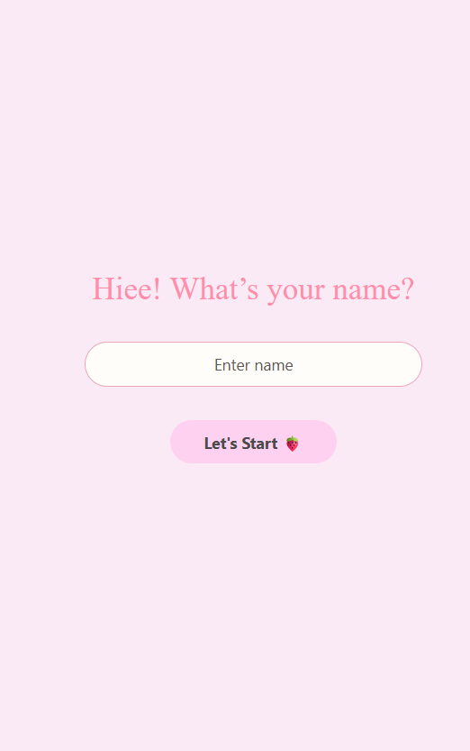

# Experiment 10: React Native TODO App

## Part 1: TODO List (Add/Delete)

### Aim
To create a basic TODO application in React Native that allows users to add and delete tasks dynamically.

### Steps Followed
1. Set up React Native project using Expo/React Native CLI
2. Created main screen with a FlatList to display tasks
3. Implemented TextInput for new task entry and a button to add tasks
4. Used useState to manage task list array
5. Rendered each task with a delete button/icon for removal
6. Tested add and delete functionality on emulator/physical device

### Key Features
- Add new tasks to the list
- Delete tasks by pressing a button/icon
- Real-time list updates using React state

### Technologies Used
- React Native
- JavaScript (with React hooks)
- Expo (optional for development/testing)

## Part 2: Persist State & Styling

### Aim
To enhance the TODO app by saving tasks persistently (even after closing the app) and applying custom styles.

### Steps Followed
1. Integrated AsyncStorage (or @react-native-async-storage/async-storage) to save/load tasks
2. Loaded saved tasks on app startup using useEffect
3. Refactored code for separation of logic and presentation
4. Applied modern styling:
    - Customized colors, padding, fonts
    - Better touch targets for add/delete
    - Responsive layout for mobile devices
5. Verified task persistence and improved aesthetics

### Key Features
- Persistent storage: Tasks remain after app restarts
- Enhanced UI/UX:
    - Improved button and input styling
    - Clearly separated list items with spacing and backgrounds
    - Subtle animations/transitions (if applied)

### Updated App Screenshot

