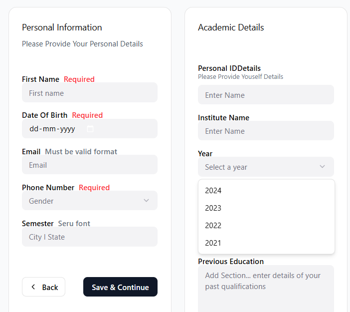

Experiment 12: Registration Form UI/UX Design
Aim
Design a comprehensive registration form using Figma with multiple field types and modern UI/UX principles.

Features Implemented
✅ Text Input Fields: Name, email, password with proper labeling
✅ Radio Button Groups: Gender selection and preference options
✅ Dropdown Menus: Country/region selection and category choices
✅ Form Validation: Error states and success feedback indicators
✅ Responsive Layout: Mobile-first design with desktop adaptability
✅ Accessibility Features: Color contrast, touch targets, clear typography

Design Elements
Form Structure
Personal Information (name, email, phone)
Demographics (gender radio buttons, age dropdown)
Location (country dropdown, city input)
Preferences (account type radio, notifications)
Security (password with strength indicators)
Terms acceptance with privacy policy links

UI/UX Principles
Visual hierarchy with clear field grouping
Single-column layout for mobile optimization
Real-time validation with clear error messaging
Consistent spacing using 8px grid system

Screenshots

