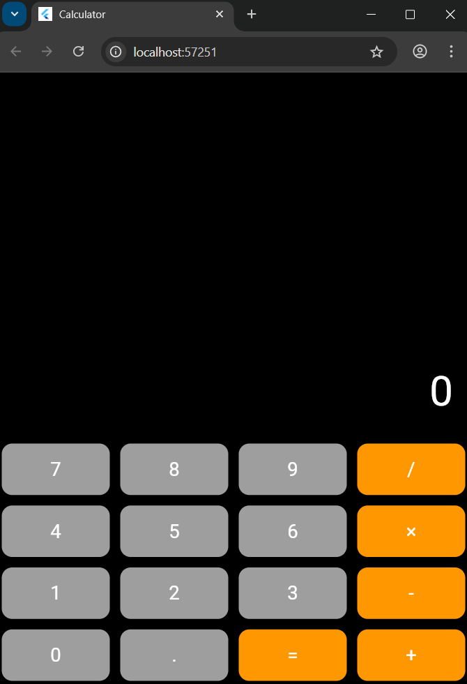
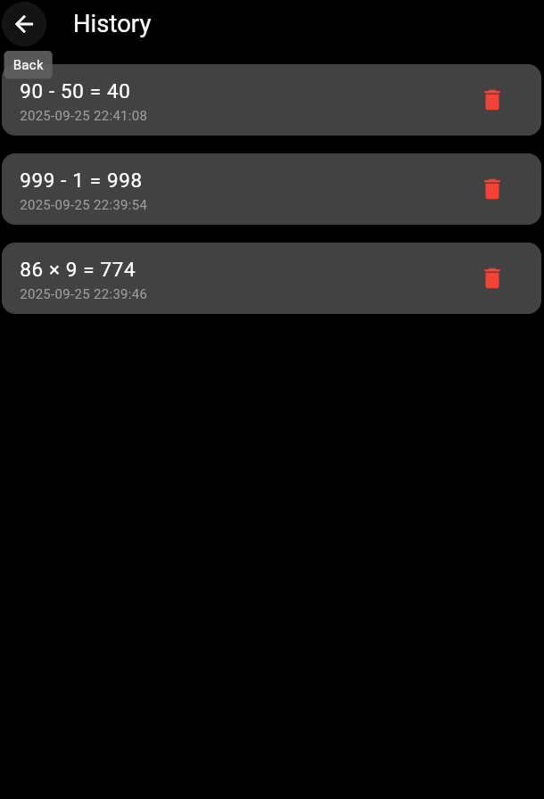
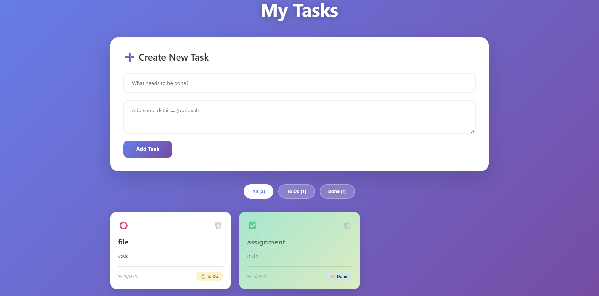

# Todo App and Calculator with Firebase - Experiment 10

Aim:.Perform CRUD operations with Firestore and store and retrieve data for calculator app and Todo list app.

### 1. Calculator 

**Extended from Experiment 4**

#### Features Implemented
- **Calculation History Storage**: Every calculation (expression, result, timestamp) is automatically saved to SQLite database when equals button is pressed
- **History View**: Dedicated history page displaying all past calculations in chronological order
- **Persistent Storage**: Calculations remain saved even after app closure and restart
- **Delete Functionality**: Individual calculations can be removed from history
- **Real-time Updates**: History updates immediately when new calculations are performed

#### Key Implementation
- SQLite database helper class for CRUD operations
- Automatic data persistence on calculation completion
- ListView implementation for history display
- Delete functionality with database synchronization
- 
- ### 2. Todo List 

**Extended from Experiment 5*
- 
## Features

- Real-time Sync: Changes appear instantly across all devices
- Cloud Storage: Data stored in Firebase Firestore
- Offline Support: Works without internet, syncs when reconnected
- Search & Filter: Find tasks quickly with built-in search
- Pinterest-style UI: Beautiful card-based layout with animations
- Status Tracking: Organize tasks by pending/completed status

## Technologies Used

- Frontend: React, CSS3 with Flexbox/Grid
- Backend: Firebase Firestore (NoSQL database)
- Real-time: Firebase onSnapshot listeners
- Styling: Custom CSS with gradients and animations

## Installation & Setup

1. Clone and install dependencies:

2. Configure Firebase:
- Create Firebase project at console.firebase.google.com
- Enable Firestore in test mode
- Copy config keys to src/firebase.js

3. Run the application:

## Key Functionality

- CREATE: Add tasks with title and description
- READ: Real-time task loading from Firestore
- UPDATE: Toggle task completion status
- DELETE: Remove tasks from cloud database
- SEARCH: Filter tasks by title/description
- OUTPUT:

- 
- 

