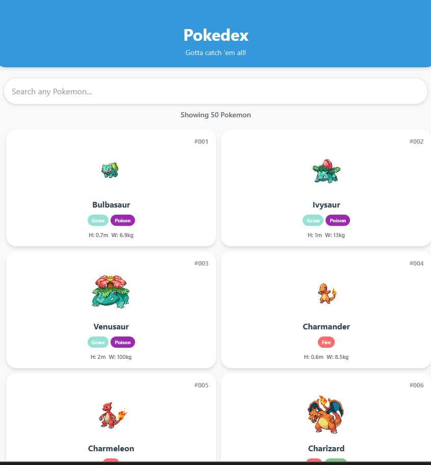
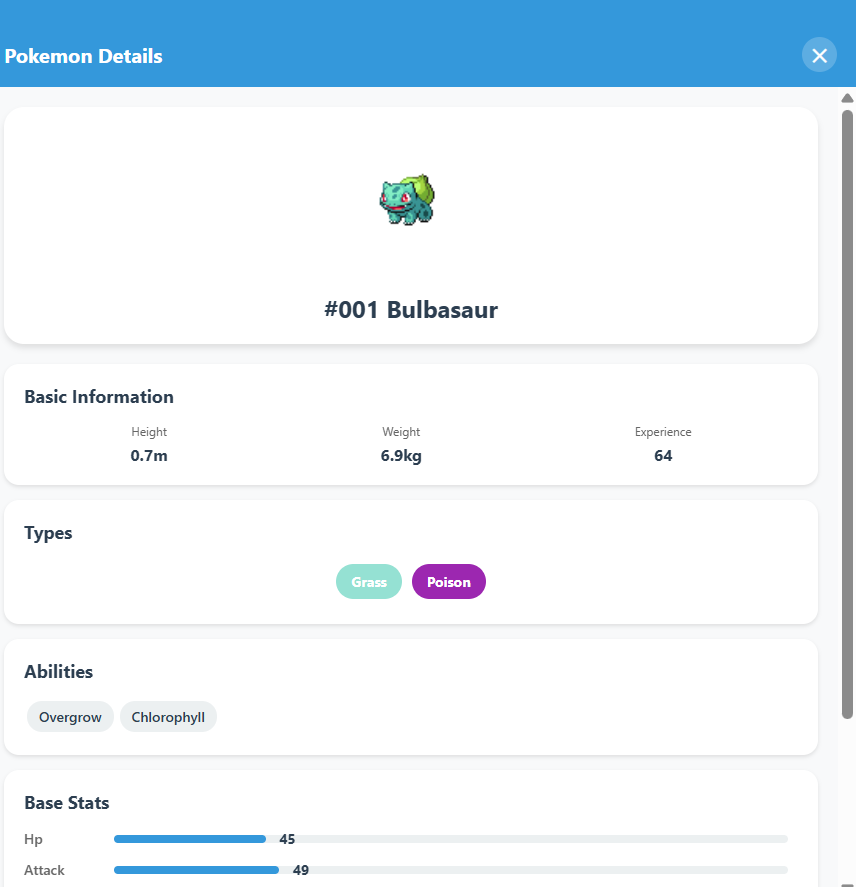
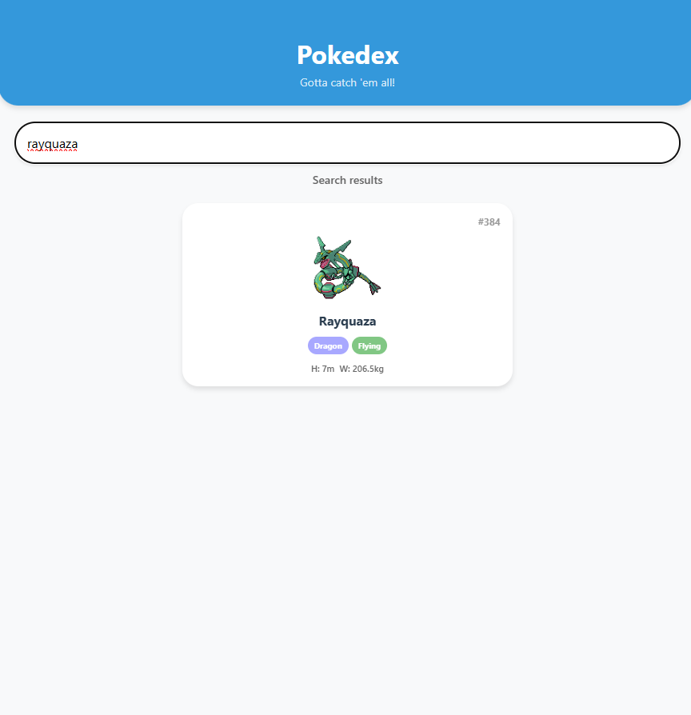

# Experiment 16

Fetch data from a public REST API and display results in the app.

## Features
- Fetch data from public REST API (PokeAPI)
- Search any Pokemon by name (900+ Pokemon available)
- Loading, error, empty, and success states
- Pull to refresh functionality
- Detailed Pokemon modal with stats and abilities
- Modular component architecture
- Professional UI design

## Tech Stack
- React Native with Expo
- JavaScript (ES6+)
- PokeAPI (public REST API)
  
## Test Cases Covered
- ✅ Success: Pokemon list display
- ✅ Loading: Spinner during API calls
- ✅ Error: Network failures with retry
- ✅ Empty: No results found
- ✅ Pull to refresh: Swipe down to reload
- ✅ Search: Find any Pokemon by name

## API Used
- **PokeAPI**: https://pokeapi.co/
- No authentication required
- 
- RESTful endpoints for Pokemon data

  
  
  
  

  

