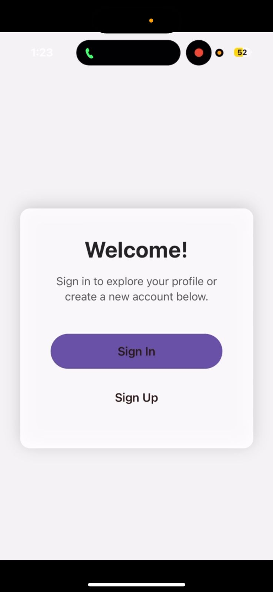

# Android Studio Firebase Authentication Setup

## 1. Create Firebase Project
- Visit Firebase Console
- Add a new project
## 2. Register App
- Add Android app with your package name
- Download google-services.json and place it in `app/`
## 3. Configure Gradle
- In `build.gradle (project)`:
## 4. Add dependencies
In `build.gradle (app)`:
## 5. Initialize Firebase
In your `MainActivity.java` or `Application.java`, Firebase is auto-initialized when primary activity runs after adding `google-services.json`.
## 6. Implement Authentication
- Create login, signup, and reset password activities
- Use FirebaseAuth methods:
  - `createUserWithEmailAndPassword()`
  - `signInWithEmailAndPassword()`
  - `sendPasswordResetEmail()`
## 7. Run App
- Build and launch from Android Studio

Output:
    
       
          
             
