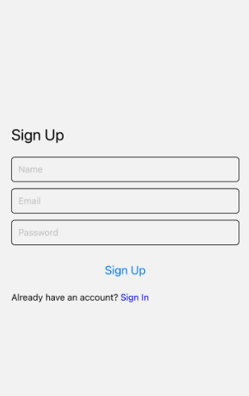
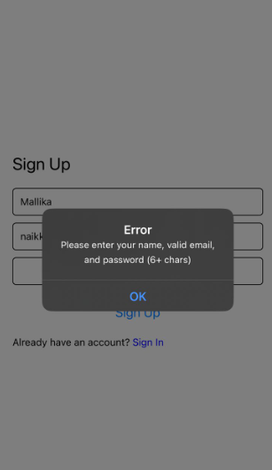
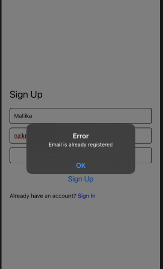

# Experiment 17 – Firebase Authentication in React Native

## Aim
To build a mobile app using **React Native** and **Firebase Authentication** that allows users to **register (sign up)** and **log in** using email and password with session management.

## Features Implemented
- Firebase Email/Password Authentication
- Name field stored and displayed using Firebase user profile
- Auth state observer to guard routes (home shown only after signin)
- Error handling for invalid email, weak password, or existing user
- Navigation between Welcome → SignIn → SignUp → Home → Profile screens
- Profile page displaying user’s name and email
- Logout functionality with session clearing

## Steps / Procedure
1. Created a Firebase project and enabled Email/Password Authentication in Firebase console.  
2. Added the Firebase SDK and initialized app using configuration keys.  
3. Created React Native screens for Welcome, SignUp, SignIn, Home, and Profile.  
4. Added authentication using Firebase Auth methods:
   - `createUserWithEmailAndPassword()` for signup
   - `signInWithEmailAndPassword()` for login
   - `updateProfile()` to store user’s name
   - `onAuthStateChanged()` to control navigation based on login state
5. Displayed the logged-in user's name and email on the profile page.
6. Implemented logout using `signOut()`.

## OUTPUT:
  
  
    
      
        
          

