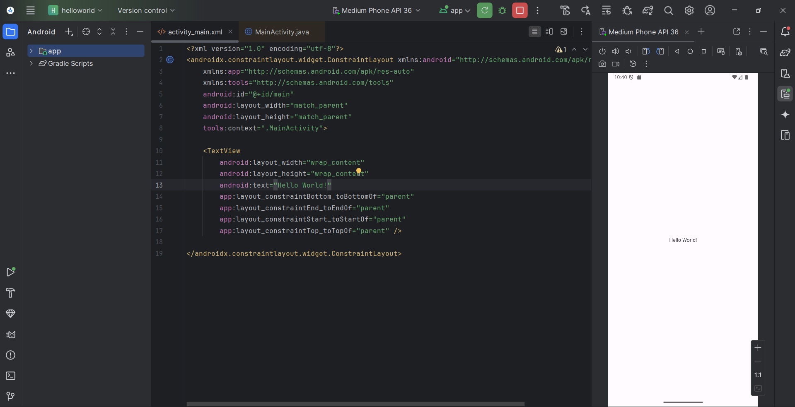

# Experiment 2: Hello World (Android Studio)

**Aim:** Create a simple Hello World app in Android Studio.

**Steps:**
1. Open Android Studio and create a new project.
2. Select "Empty Activity".
3. Add "Hello World" text in activity_main.xml.
4. Run the app.

**Expected Output:**

