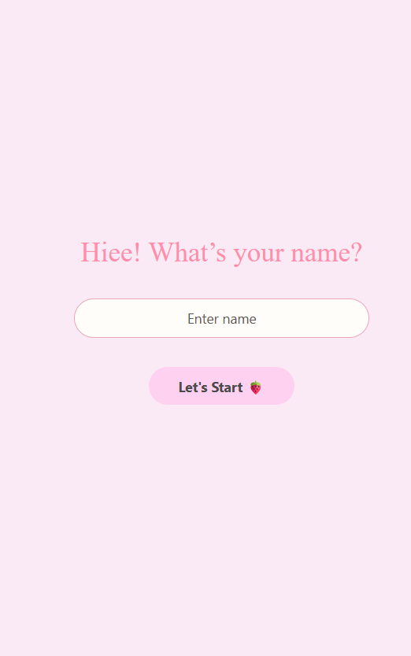
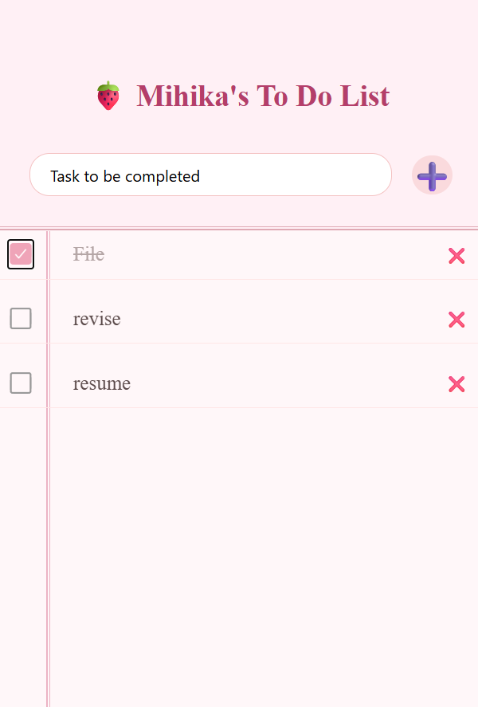

# Experiment 3: Build small application

## Aim  
Programming basics for app development

## Steps Followed  
1. Set up a new React Native project.  
2. Designed a UI with a welcome screen and to-do list screen.  
3. Added functionality to:  
   - Add new tasks with placeholder text.  
   - Mark tasks as complete (with strikethrough).  
   - Delete tasks.  
4. Tested the app on emulator/physical device to ensure all features worked smoothly.  

## Expected Output  
- User can enter their name on the welcome screen.  
- A personalized to-do list.  
- Tasks can be:  
  - Added 
  - Marked complete 
  - Deleted 

## Screenshots  

Example:  
  
  
