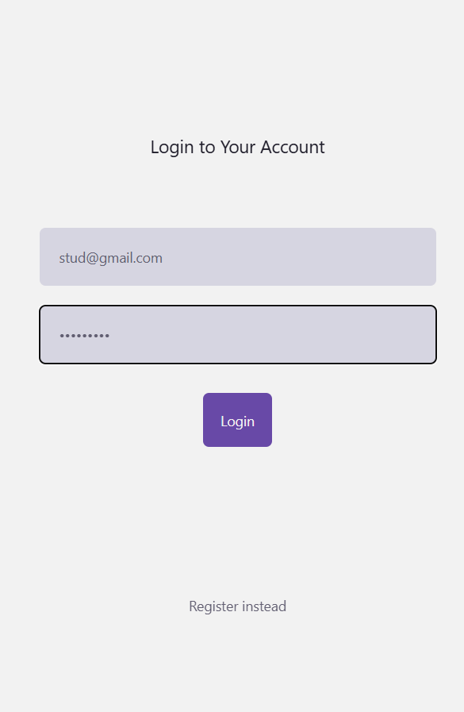
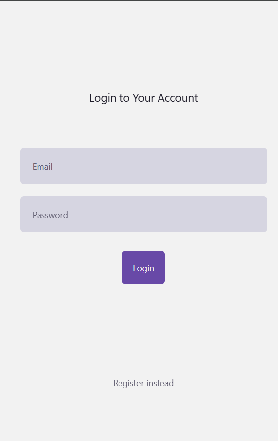
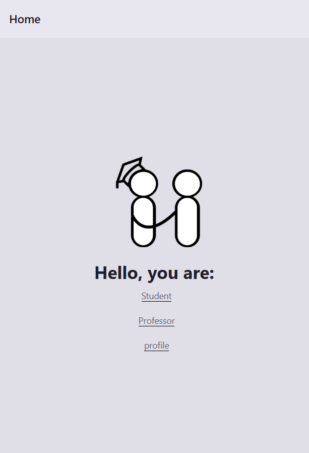

# Experiment 4: Building User Interface 

## Aim  
To study about building user interface in app development.

## Steps Followed  
1. Created a new React Native project / added new screens to existing project.  
2. Designed a **Login Screen** and **Register Screen** with:  
   - Input fields for Email/Username and Password.  
   - A Login button.    
4. Linked navigation between Login → Homepage using React Navigation.  
5. Tested on emulator/phone to confirm smooth transitions.  

## Expected Output  
- **Login Screen**: User enters details and clicks Login.  
- **Homepage**: Displays a welcome message and homepage UI.  

Example: 
  
  
  
