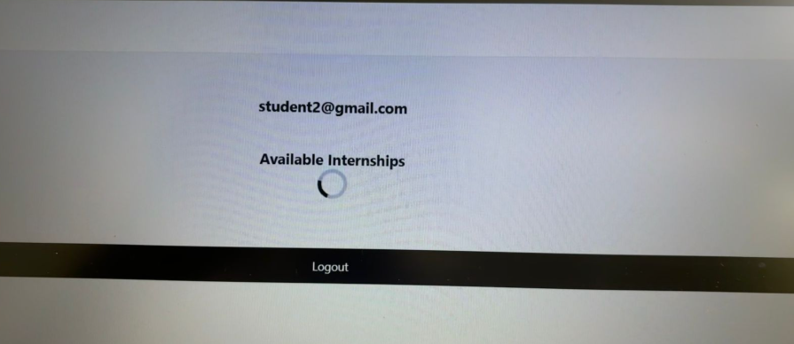
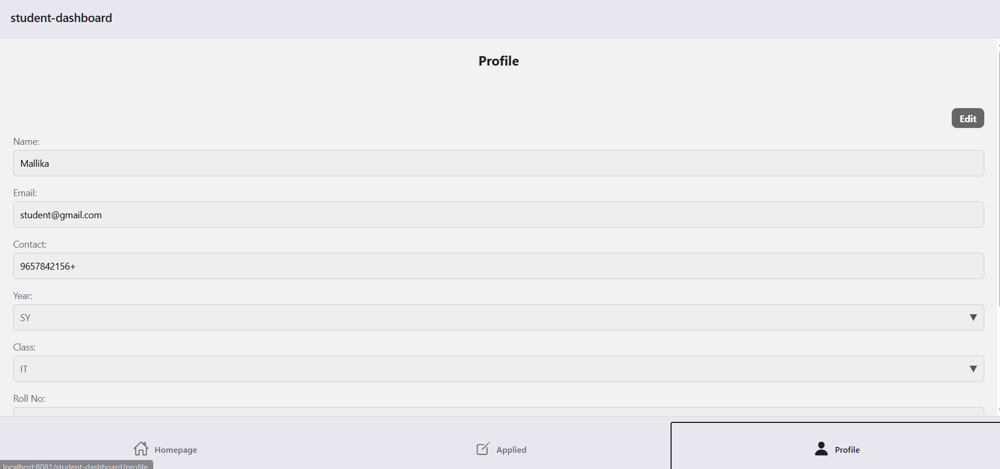

# Experiment 5: Navigation Design and Animation

## Aim  
To study navigation design and animation

## Steps Followed  
1. Set up **React Navigation** in the project.  
2. Created multiple screens .  
3. Added a **loader animation**:  
4. Implemented navigation flow. 
5. Tested transitions and animations on emulator/physical device.  

## Expected Output  
- When the app opens, a **loader animation** (e.g., spinning circle) is displayed.  
- After loading, user is automatically navigated to the next screen.  
- Navigation between screens is smooth and animated.  

Example:  
  
  
