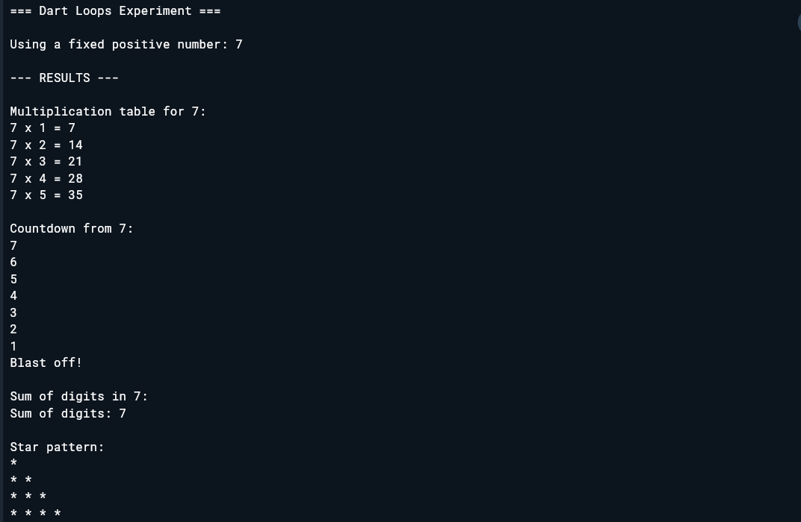

# Experiment 7: Dart I/O & Loops

## Aim
To implement and demonstrate input/output operations and different types of loops in Dart programming language.

## Steps Followed

1. **Set up development environment:**
   - Accessed DartPad online development environment
   - No local installation required

2. **Created Dart program structure:**
   - Added import statement for I/O operations (`import 'dart:io';`)
   - Created main() function

3. **Implemented input/output operations:**
   - Used `stdin.readLineSync()` for user input
   - Used `print()` statements for output display

4. **Demonstrated different loop types:**
   - **FOR LOOP:** Multiplication table generation
   - **WHILE LOOP:** Countdown sequence  
   - **DO-WHILE LOOP:** Sum of digits calculation
   - **NESTED LOOPS:** Star pattern printing

5. **Executed and tested:**
   - Ran program in DartPad
   - Entered test input values
   - Verified all loop operations work correctly

## Code Implementation

The program demonstrates:
- User input handling with validation
- For loop with counter control
- While loop with condition checking
- Do-while loop ensuring at least one execution
- Nested loops for pattern generation
- Proper output formatting

## Expected Output

When user enters a number (e.g., 5), the program displays:
- Multiplication table from 1 to 5
- Countdown from the entered number to 1
- Sum of all digits in the number
- Star pattern with increasing rows

**Screenshot:**

