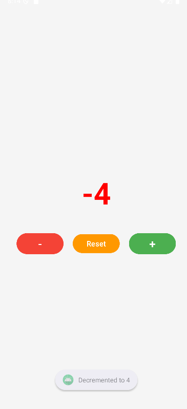

# Experiment 8: Android Studio Setup + Counter App

## Aim
To set up Android Studio development environment and create a counter application demonstrating basic Android UI components and event handling.

## Part 1: Android Studio Setup + Counter App

### Environment Setup
1. **Downloaded and installed Android Studio** from developer.android.com
2. **Created new Android project** with Empty Views Activity template
3. **Set up Android emulator** for app testing
4. **Configured project settings**:
   - Project Name: CounterApp
   - Package: com.example.counterapp
   - Language: Java
   - API Level: 24 (Android 7.0)

### Steps Followed

1. **Project Creation:**
   - Selected "Empty Views Activity" template
   - Configured project with Java language support
   - Waited for Gradle sync and initial setup

2. **UI Design (activity_main.xml):**
   - Created LinearLayout with vertical orientation
   - Added TextView for counter display
   - Added Button for increment functionality
   - Applied styling and margins

3. **Logic Implementation (MainActivity.java):**
   - Connected UI elements using findViewById()
   - Implemented button click listener
   - Added counter increment functionality
   - Integrated Toast messages for user feedback

4. **Testing:**
   - Built and ran app on emulator
   - Verified counter increments on button clicks
   - Confirmed Toast messages appear correctly

### Features Implemented
- **Counter Display**: Large TextView showing current count
- **Increment Button**: Button to increase counter by 1
- **Toast Notifications**: Brief messages showing current count
- **Clean UI**: Centered layout with proper spacing

### Expected Output Part 1
- App displays "0" initially
- Each button click increments counter by 1
- Toast message shows "Count: X" after each click
- Blue colored counter text

## Part 2: Extended Counter (State, Layouts)

### Aim
To extend the counter app with enhanced state management, improved layouts, and additional functionality.

### Additional Features Added

1. **Multiple Buttons:**
   - **Increment Button (+)**: Increases counter by 1
   - **Decrement Button (-)**: Decreases counter by 1
   - **Reset Button**: Sets counter back to 0

2. **Enhanced UI Design:**
   - Three buttons arranged horizontally
   - Color-coded buttons (Green +, Red -, Orange Reset)
   - Larger counter display (64sp font size)
   - Improved background and spacing

3. **State Management:**
   - **onSaveInstanceState()**: Saves counter value
   - **onRestoreInstanceState()**: Restores counter value
   - **Orientation persistence**: Counter survives screen rotation

4. **Dynamic Visual Feedback:**
   - **Green text**: Positive numbers
   - **Red text**: Negative numbers  
   - **Blue text**: Zero value
   - **Enhanced Toast messages**: Action-specific notifications

### Screenshot

*Basic counter app with single increment button*

