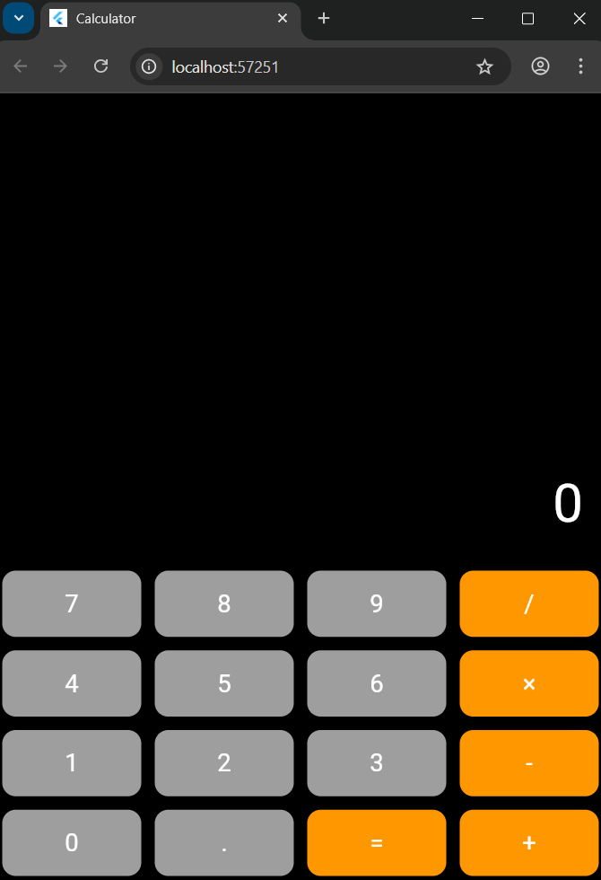

# Experiment 9: Flutter SDK + Calculator UI

Part a:

## Aim
To set up Flutter development environment and create a calculator UI with basic layout design.

## Steps Followed
1. Set up Flutter SDK and added to PATH
2. Created new Flutter project using `flutter create calculator_app`
3. Implemented CalculatorApp and CalculatorUI classes
4. Designed 4x4 button grid layout using Row/Column widgets
5. Applied styling with Material Design components

## Features
- Black background with white text display
- 16 calculator buttons in grid layout
- Orange operation buttons (+, -, ×, ÷, =)
- Grey number buttons (0-9, .)
- Rounded corners and responsive design

## Screenshot

